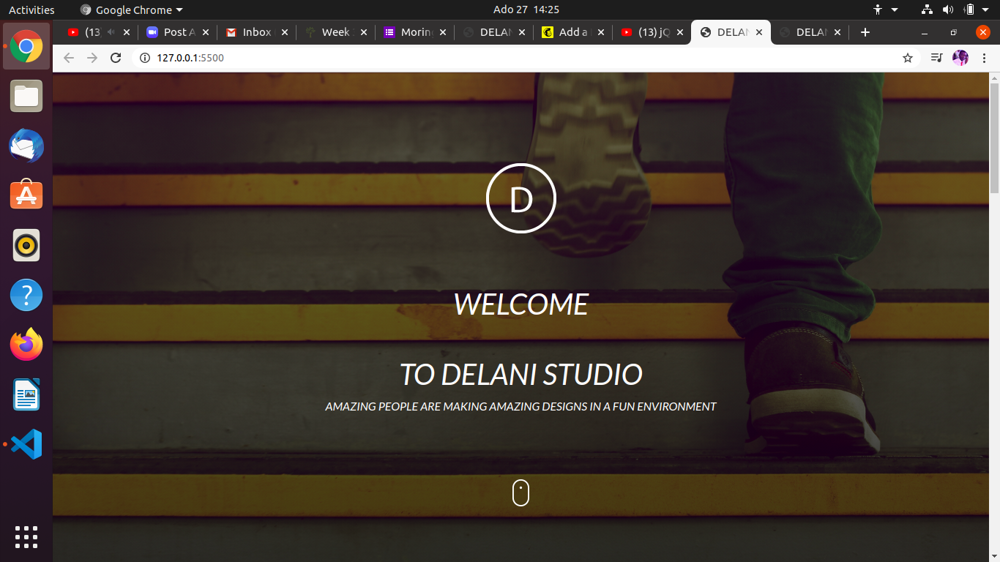

# DELANI STUDIO
This website  is about a company that deals with design,product management and offers soft solutions to organisations.This project mainly focused on the structure of the page and interaction of the webpage.
Here is the [website](https://tomito26.github.io/delano-studio/)

## How To Access
You can access it by copying  the [repository](https://github.com/tomito26/delano-studio.git) and setting it up in your local machine by following the steps below .
After copying the  repo link  paste it on the terminal 
```
$ git clone <repo-link>
```
you then go to the directory/folder of the project you just cloned
```
$ cd  directory
```
You then type  code . for Vs code or [atom .]() for atom IDE then press enter  and you are ready to go
```
$ code .
```
## How To Contribute
You can contribute by forking the project  and following the above steps

 ## Technologies Used
 * HTML
 * CSS
 * Javascript
 * Jquery

## Support and Contact
If you run into any challenge in setting up the project or question feel free to contact me tommybwah@gmail.com

## License and Copyright
Licensed under [MIT license](LICENSE).


